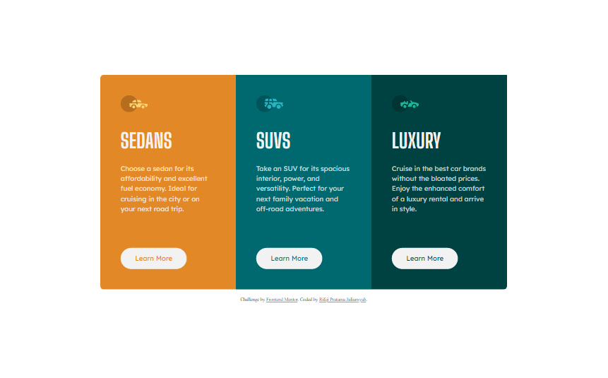

# Frontend Mentor - 3-column preview card component solution

This is a solution to the [3-column preview card component challenge on Frontend Mentor](https://www.frontendmentor.io/challenges/3column-preview-card-component-pH92eAR2-). Frontend Mentor challenges help you improve your coding skills by building realistic projects. 

## Table of contents

- [Overview](#overview)
  - [The challenge](#the-challenge)
  - [Screenshot](#screenshot)
  - [Links](#links)
- [My process](#my-process)
  - [Built with](#built-with)
  - [What I learned](#what-i-learned)
  - [Useful resources](#useful-resources)
- [Author](#author)

## Overview

### The challenge

Users should be able to:

- View the optimal layout depending on their device's screen size
- See hover states for interactive elements

### Screenshot

### Links

- Solution URL: [https://www.frontendmentor.io/solutions/3column-preview-card-component-vAkG76-nDq](https://www.frontendmentor.io/solutions/3column-preview-card-component-vAkG76-nDq)
- Live Site URL: [https://3-column-preview-frontendmentor.vercel.app/](https://3-column-preview-frontendmentor.vercel.app/)

## My process

### Built with

- Semantic HTML5 markup
- CSS custom properties
- CSS Grid
- Mobile-first workflow
- SCSS/SASS

### What I learned

I learned how to using pseudo :nth-child()

### Useful resources

- [https://www.joshwcomeau.com/css/custom-css-reset/](https://www.joshwcomeau.com/css/custom-css-reset/) - This helped me for doing CSS reset.
- [https://www.rifqipratamaj.me/blog/perkenalan-dan-cara-instalasi-sass/](https://www.rifqipratamaj.me/blog/perkenalan-dan-cara-instalasi-sass/) - This is an amazing article which helped me for installation sass
-[https://www.rifqipratamaj.me/blog/belajar-sass-variabel/](https://www.rifqipratamaj.me/blog/belajar-sass-variabel/) - This article helped me for using SASS/SCSS variable.

## Author

- Website - [Rifqi Pratama Juliansyah](https://www.rifqipratamaj.me/)
- Frontend Mentor - [@juliansyahrifqi](https://www.frontendmentor.io/profile/juliansyahrifqi)
- Twitter - [@juliansyahrifq1](https://www.twitter.com/juliansyahrifq1)
